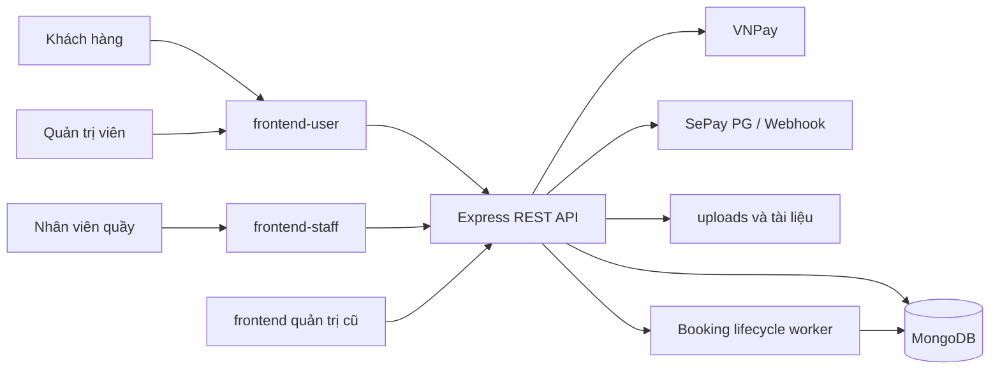

# BÁO CÁO TỔNG QUAN VÀ ĐÁNH GIÁ DỰ ÁN AURACINEMA

**Ngày rà soát:** 12/09/2026  
**Phạm vi:** mã nguồn backend, ba ứng dụng frontend, mô hình dữ liệu, tài liệu thiết kế, cấu hình, kiểm thử và trạng thái đóng gói dự án.

## 1. Tóm tắt điều hành

AuraCinema là hệ thống quản lý và đặt vé rạp chiếu phim theo kiến trúc web client-server. Sản phẩm đã vượt xa một bài CRUD cơ bản: hệ thống có luồng giữ ghế chống bán trùng, đặt vé và thanh toán, phát hành vé QR, in/check-in vé, voucher, chương trình thành viên, quản trị nội dung, báo cáo doanh thu và bán vé tại quầy.

Ứng dụng chính hiện gồm backend Express/MongoDB và frontend React. `frontend-user` là giao diện đầy đủ nhất, chứa cả trang khách hàng và khu vực quản trị. Thư mục `frontend` là một giao diện quản trị cũ, trùng lặp một phần chức năng. `frontend-staff` là giao diện nhân viên mới ở mức nguyên mẫu khả dụng cho bán vé tiền mặt tại quầy; các mục quản lý phòng, báo cáo ca và lịch sử giao dịch mới chỉ là giao diện chờ.

Kết quả kiểm chứng cho thấy luồng nghiệp vụ cốt lõi có nền tảng tốt: 107/108 kiểm thử backend đạt, 21/21 kiểm thử frontend chính đạt, và hai ứng dụng frontend chính build thành công. Tuy nhiên, dự án chưa nên đưa thẳng lên môi trường thật trước khi xử lý các API quản trị chưa được bảo vệ, hoàn thiện cấu hình triển khai, làm sạch kho Git và đồng bộ lại tài liệu.

## 2. Mục tiêu và đối tượng sử dụng

### 2.1. Mục tiêu

- Cung cấp cho khách hàng quy trình xem phim, chọn suất, giữ ghế, mua dịch vụ, áp dụng voucher, thanh toán và nhận vé điện tử.
- Cung cấp cho quản trị viên công cụ quản lý phim, lịch chiếu, rạp, phòng, ghế, người dùng, khuyến mãi, vé và doanh thu.
- Cung cấp cho nhân viên tại quầy quy trình bán vé trực tiếp và in vé.
- Bảo vệ tính nhất quán của ghế, tồn kho combo, voucher, thanh toán và điểm thưởng khi có nhiều giao dịch đồng thời.

### 2.2. Nhóm người dùng

| Vai trò | Khả năng chính |
|---|---|
| Khách chưa đăng nhập | Xem phim, lịch chiếu, tin tức, khuyến mãi, giá vé và chính sách |
| Thành viên | Giữ ghế, đặt vé, thanh toán, xem đơn/vé, dùng voucher, tích và đổi điểm |
| Nhân viên | Bán vé tại quầy, nhận tiền mặt, in vé; các chức năng ca làm việc đang phát triển |
| Quản trị viên | Quản lý toàn bộ danh mục, lịch chiếu, booking, vé, người dùng, nội dung và báo cáo |

## 3. Quy mô mã nguồn

Kết quả thống kê trên mã nguồn nghiệp vụ, không tính thư viện cài sẵn:

| Khu vực | Số tệp mã chính | Số dòng gần đúng |
|---|---:|---:|
| `backend/src` | 120 | 17.830 |
| `backend/test` | 17 | 3.119 |
| `frontend/src` | 39 | 7.335 |
| `frontend-user/src` | 136 | 31.475 |
| `frontend-staff/src` | 4 | 49 dòng JSX/JS/CSS theo phép đếm hiện tại; phần lớn giao diện được dồn trong một tệp JSX và một tệp CSS lớn |

Backend được chia thành 30 model, 26 controller, 19 service và 27 router. Giao diện tích hợp có 33 trang khách hàng/quản trị. Toàn bộ tập tin dự án sau khi loại thư viện, bản build và tệp upload gồm khoảng 372 tệp.

## 4. Công nghệ sử dụng

| Lớp | Công nghệ |
|---|---|
| Backend | Node.js, Express 4, JavaScript ES Modules |
| Cơ sở dữ liệu | MongoDB, Mongoose 9 |
| Frontend | React 19, React Router 7, Vite 7/8 |
| Giao tiếp | REST API, JSON, Axios/Fetch |
| Giao diện | CSS, Tailwind CSS 4 trong ứng dụng tích hợp, React Icons |
| Biểu đồ | Recharts |
| Thanh toán | VNPay và SePay PG; có webhook và tác vụ đối soát SePay |
| Vé | QR Code, HTML5 QR scanner, PDFMake |
| Tài liệu/chính sách | Nhập nội dung từ Word và PDF |
| Kiểm thử | Node.js built-in test runner |

## 5. Kiến trúc hệ thống



Backend đang dùng cấu trúc phân lớp thực dụng:

- **Router:** khai báo đường dẫn, xác thực và phân quyền.
- **Controller:** nhận yêu cầu, kiểm tra đầu vào và tạo phản hồi.
- **Service:** xử lý nghiệp vụ phức tạp như giữ ghế, booking, voucher, vé, thanh toán và loyalty.
- **Repository:** hiện mới tách riêng cho dữ liệu ghế suất chiếu.
- **Model:** định nghĩa schema và index MongoDB.
- **Worker/script:** dọn booking hết hạn, seed dữ liệu và đối soát.

## 6. Các phân hệ chức năng

### 6.1. Khách hàng

- Đăng ký, đăng nhập, quên/đặt lại mật khẩu, cập nhật hồ sơ và đổi mật khẩu.
- Xem danh sách phim, chi tiết phim, trailer và lịch chiếu.
- Chọn tối đa 8 ghế; kiểm tra quy tắc ghế đôi.
- Giữ ghế theo phiên do server quản lý và khôi phục phiên sau khi tải lại trang.
- Chọn combo bắp/nước, áp dụng voucher hợp lệ và tạo booking.
- Thanh toán qua VNPay hoặc SePay PG.
- Xem kết quả đặt vé, lịch sử đơn và QR theo đơn/từng vé.
- Xem hạng thành viên, số dư điểm, lịch sử điểm, ví voucher và đổi thưởng khi tính năng được bật.
- Xem tin tức, khuyến mãi, giới thiệu, giá vé, điều khoản, chính sách và hướng dẫn.

### 6.2. Quản trị

- Dashboard: tổng quan booking, vé, doanh thu ngày/tuần/tháng, so sánh kỳ, phim doanh thu cao và combo bán chạy.
- Quản lý thể loại, phim, trailer, rạp, phòng, sơ đồ ghế, loại ghế và lịch chiếu.
- Kiểm tra xung đột lịch chiếu và phân trang nhóm suất chiếu.
- Quản lý booking, trạng thái thanh toán và hủy đơn theo chính sách.
- Quét QR đơn để in lần đầu, in lại có lý do, quét QR vé và check-in; lưu lịch sử thao tác.
- Quản lý người dùng, trạng thái tài khoản, đặt lại mật khẩu và điều chỉnh điểm thưởng.
- Quản lý combo, voucher, quà tặng, nội dung marketing và chính sách.
- Quản trị chương trình loyalty, danh mục đổi thưởng và cấp voucher thủ công.

### 6.3. Nhân viên quầy

- Nhận token dành cho nhân viên từ luồng chuyển hướng đăng nhập.
- Xem suất chiếu còn khả dụng và sơ đồ ghế.
- Chọn ghế, bán vé tiền mặt và in vé.
- Các mục phòng/ghế, báo cáo ca và lịch sử giao dịch chưa có nghiệp vụ hoàn chỉnh.

## 7. Luồng nghiệp vụ đặt vé

1. Khách đăng nhập và chọn suất chiếu.
2. Frontend tải sơ đồ ghế và trạng thái mới nhất từ backend.
3. Khi khách chọn ghế, backend tạo/cập nhật `SeatHold`; ghế chuyển sang `held` và gắn đúng chủ phiên.
4. Khi tạo đơn, backend dùng transaction để xác minh phiên giữ ghế, dự trữ combo/voucher, tạo `Booking`, chuyển ghế sang `reserved` và mở thời hạn thanh toán.
5. Cổng thanh toán xử lý giao dịch; callback/return được backend xác minh.
6. Khi thanh toán thành công, ghế chuyển sang `booked`, booking được xác nhận và mỗi ghế được phát hành đúng một `Ticket`.
7. Khách nhận QR đơn và QR riêng từng vé. QR đơn phục vụ tra cứu/in nhiều vé; QR vé phục vụ check-in một ghế.
8. Worker định kỳ dọn phiên giữ ghế và booking quá hạn, trả lại ghế, combo và quyền sử dụng voucher một cách lặp-an-toàn.

Thời hạn thực tế trong mã hiện là **5 phút giữ ghế và 5 phút thanh toán**. Tài liệu thiết kế cũ ghi 10 phút thanh toán, vì vậy tài liệu phải được cập nhật để tránh mô tả sai sản phẩm.

## 8. Mô hình dữ liệu thực tế

README gốc mô tả mô hình bảng quan hệ, nhưng hệ thống hiện dùng MongoDB/Mongoose. Các aggregate quan trọng gồm:

- **User:** tài khoản, vai trò, trạng thái, hạng thành viên, tổng chi tiêu, điểm thưởng và dữ liệu reset mật khẩu.
- **Movie/Genre/Trailer/MarketingContent:** danh mục phim và nội dung công khai.
- **Cinema/Room/SeatType/Seat:** cấu trúc vật lý của rạp và phòng chiếu.
- **Showtime/ShowtimeSeat/SeatHold:** lịch chiếu, giá/trạng thái từng ghế và quyền sở hữu phiên giữ ghế.
- **Booking:** aggregate gốc của đơn hàng; lưu snapshot phim, suất, rạp/phòng, ghế, combo, voucher, giá, thanh toán và QR đơn.
- **Ticket/TicketScanLog/BookingActionLog:** vòng đời vé, check-in, in lần đầu/in lại và nhật ký quản trị.
- **Payment/SepayTransaction:** dữ liệu giao dịch và đối soát thanh toán.
- **Voucher/UserVoucher/VoucherGrant/VoucherUsage/VoucherUsageCounter:** phát hành, giữ chỗ, sử dụng và thống kê voucher.
- **RewardPointLog/RewardOffer:** sổ cái điểm thưởng và danh mục đổi thưởng.
- **Gift/Policy/Setting/AuditLog:** quà tặng, chính sách, cấu hình và kiểm toán.

Một điểm thiết kế tốt là booking phiên bản mới lưu snapshot nghiệp vụ. Việc sửa tên phim, phòng, loại ghế, combo hoặc voucher sau này không làm thay đổi nội dung của đơn đã mua.

## 9. An toàn và tính nhất quán

### Điểm tốt

- Mật khẩu được băm bằng `scrypt` với salt ngẫu nhiên và so sánh bằng hàm chống timing attack.
- JWT có thời hạn, chữ ký HMAC và bị vô hiệu hóa gián tiếp sau khi người dùng đổi mật khẩu.
- Có phân vai `user`, `staff`, `admin` ở middleware.
- Các luồng giữ ghế, đổi giữ ghế sang booking, thanh toán, phát hành vé và in vé có kiểm tra sở hữu/trạng thái và nhiều thao tác nguyên tử.
- Token QR chỉ lưu dạng hash và bản mã hóa; API thông thường không trả trường bí mật.
- Có rate limit cho đăng nhập và các thao tác quét QR.
- Có các security header cơ bản và giới hạn kích thước JSON.

### Rủi ro ưu tiên cao

Một số route thay đổi dữ liệu chưa dùng middleware xác thực/phân quyền. Nếu API được mở ra Internet, người không đăng nhập có thể gọi trực tiếp các thao tác tạo/sửa/xóa:

- `/api/cinemas`
- `/api/rooms`
- `/api/seats`
- `/api/seat-types` và alias không có tiền tố `/api`
- `/api/trailers`
- các thao tác tạo/sửa/xóa của `/api/showtime-seats` và alias tương ứng

Giao diện có chặn route không thay thế được kiểm tra quyền ở backend. Đây là hạng mục cần sửa trước khi triển khai thật.

### Rủi ro cấu hình

- Khi không cấu hình danh sách origin, CORS hiện chấp nhận mọi origin, kể cả trong production.
- Dự án chưa có `.env.example`; danh sách biến cho MongoDB, JWT, QR encryption, VNPay, SePay, URL frontend và CORS chỉ có thể suy ra từ mã.
- JWT được tự triển khai thay vì dùng thư viện đã được kiểm chứng rộng rãi; cần thêm kiểm thử cấu trúc header/payload và quy trình xoay secret.
- Rate limit hiện phù hợp một tiến trình; khi chạy nhiều instance cần kho dùng chung như Redis.
- Production yêu cầu MongoDB replica set hoặc sharded cluster để bảo vệ transaction, nhưng chưa có cấu hình triển khai kèm theo.

## 10. Kết quả kiểm thử và build

| Hạng mục | Kết quả |
|---|---|
| Backend `npm test` | 108 ca: 107 đạt, 0 lỗi, 1 bỏ qua |
| Frontend tích hợp `npm test` | 21/21 đạt |
| Build `frontend-user` | Thành công |
| Build `frontend` | Thành công |
| Build `frontend-staff` | Chưa chạy được vì thư mục này chưa cài dependency cục bộ (`vite` không được tìm thấy) |
| Lint `frontend-user` | Không đạt: 30 lỗi |
| Lint `frontend` | Không đạt: 17 lỗi |

Ca backend bị bỏ qua là kiểm thử transaction loyalty trên MongoDB replica set vì máy rà soát không có chương trình `mongod`. Đây không phải một ca đã đạt; cần chạy lại trong CI hoặc môi trường có MongoDB phù hợp.

Các lỗi lint chủ yếu liên quan tới cập nhật state đồng bộ trong React effect, ngoài ra có biến không dùng và một trường hợp sửa trực tiếp prop. Build vẫn thành công nhưng cổng chất lượng chưa xanh.

## 11. Hiệu năng và khả năng bảo trì

### Hiệu năng frontend

Build `frontend-user` cảnh báo một số chunk lớn. Đáng chú ý:

- `ticketPdf`: khoảng 1,36 MB trước gzip, khoảng 585 KB sau gzip.
- Dashboard: khoảng 394 KB trước gzip.
- Bundle chính: khoảng 353 KB trước gzip.
- Ticket scanner: khoảng 350 KB trước gzip.

Nên tách PDF/QR/chart thành các phần chỉ tải khi người dùng mở đúng chức năng, đồng thời cấu hình manual chunks cho thư viện nặng.

### Bảo trì mã

- Một số controller/service rất lớn: `showtimesControllers`, `dashboardControllers`, `bookingsControllers` và `voucherService` nên được tách theo use case.
- `frontend` và phần admin trong `frontend-user` trùng nhiều trang/component, tạo nguy cơ sửa một nơi nhưng quên nơi còn lại.
- `frontend-staff/src/App.jsx` dồn phần lớn nghiệp vụ vào một component; cần tách API, xác thực, layout, seat map và sale flow.
- Tài liệu README của từng frontend vẫn là nội dung mặc định của Vite và chưa hướng dẫn vận hành dự án.
- README gốc mô tả schema SQL cũ, không phản ánh 30 model MongoDB và các luồng mới.

### Vệ sinh kho Git

`.gitignore` hiện gần như rỗng. Kho Git đang theo dõi khoảng **3.836 tệp trong `node_modules`** và **476 tệp trong các thư mục `dist`**. Điều này làm tăng xung đột, dung lượng clone và nguy cơ đưa artifact máy cá nhân vào lịch sử. Cần bổ sung quy tắc ignore rồi bỏ theo dõi các artifact, nhưng phải thực hiện bằng một commit có kiểm soát để không xóa nhầm dữ liệu nguồn.

## 12. Mức độ hoàn thiện theo phân hệ

| Phân hệ | Đánh giá |
|---|---|
| Danh mục phim và lịch chiếu | Tốt |
| Giữ ghế và chống bán trùng | Tốt, có thiết kế và kiểm thử rõ |
| Booking và vé QR | Tốt, đã chuyển sang mô hình order-centric |
| Thanh toán | Khá tốt, cần kiểm thử tích hợp sandbox/production đầy đủ |
| Voucher và loyalty | Khá toàn diện, cần chạy kiểm thử replica set bị bỏ qua |
| Dashboard quản trị | Đầy đủ chỉ số chính |
| CMS tin tức/khuyến mãi/chính sách | Đã có chức năng quản trị và công khai |
| Staff POS | Bán vé tiền mặt hoạt động ở mức đầu; các màn khác chưa hoàn thiện |
| Bảo mật API | Chưa đạt do một nhóm route quản trị chưa được bảo vệ |
| Tài liệu triển khai | Chưa đạt |
| Chất lượng lint/CI | Chưa đạt |

## 13. Kế hoạch cải thiện đề xuất

### Giai đoạn 1 — trước khi demo công khai hoặc deploy

1. Gắn `authMiddleware` và `authorizeRoles("admin")` cho toàn bộ API thay đổi rạp, phòng, ghế, loại ghế, trailer và ghế suất chiếu.
2. Thêm kiểm thử khẳng định request không token nhận `401`, sai vai trò nhận `403` và admin được phép thao tác.
3. Tạo `.env.example`, kiểm tra bắt buộc secret/URL khi khởi động production và đóng CORS mặc định.
4. Chạy kiểm thử tích hợp loyalty trên MongoDB replica set.
5. Sửa 30 lỗi lint ở `frontend-user` và 17 lỗi ở `frontend`.

### Giai đoạn 2 — ổn định dự án

1. Chọn một nguồn giao diện quản trị chính; đề xuất giữ admin trong `frontend-user` và đưa `frontend` cũ vào trạng thái deprecated hoặc loại bỏ sau khi đối chiếu.
2. Hoàn thiện `frontend-staff`, tách component và cài/khóa dependency đầy đủ.
3. Bổ sung `.gitignore`, bỏ theo dõi `node_modules`, `dist`, log và file môi trường.
4. Viết README mới: kiến trúc, yêu cầu hệ thống, biến môi trường, cách cài/chạy/test/build và tài khoản demo.
5. Thêm pipeline CI chạy test, lint và build cho từng ứng dụng.

### Giai đoạn 3 — tối ưu và vận hành

1. Lazy-load PDFMake, QR scanner và Recharts; theo dõi kích thước bundle trong CI.
2. Chuyển rate limit sang kho dùng chung khi scale nhiều instance.
3. Bổ sung logging có cấu trúc, health check, error monitoring, backup/restore và quy trình xoay secret.
4. Thêm kiểm thử end-to-end cho toàn bộ hành trình chọn ghế → thanh toán sandbox → nhận vé → in → check-in.
5. Theo dõi đối soát thanh toán muộn, hoàn tiền và sai lệch loyalty bằng dashboard/alert.

## 14. Kết luận

AuraCinema có phạm vi chức năng rộng và phần nghiệp vụ cốt lõi được đầu tư nghiêm túc, đặc biệt ở chống bán trùng ghế, transaction booking, phát hành vé idempotent, QR theo đơn/từng vé, voucher và loyalty. Với quy mô hơn 56.000 dòng mã nguồn nghiệp vụ và kiểm thử, dự án phù hợp để phát triển thành đồ án tốt nghiệp hoặc sản phẩm MVP có chiều sâu.

Điểm cản lớn nhất không nằm ở thiếu chức năng mà ở độ sẵn sàng vận hành: phân quyền backend chưa bao phủ toàn bộ API, tài liệu đã lỗi thời, lint chưa đạt, frontend bị trùng lặp và kho Git chứa artifact sinh tự động. Sau khi hoàn thành giai đoạn 1 và 2, dự án sẽ có nền tảng đáng tin cậy hơn cho demo, nghiệm thu và triển khai.

## Phụ lục A — Lệnh kiểm chứng đã sử dụng

```text
backend:       npm test
frontend-user: npm test
frontend-user: npm run lint
frontend-user: npm run build
frontend:      npm run lint
frontend:      npm run build
frontend-staff:npm run build
```

## Phụ lục B — Giới hạn của lần rà soát

- Không kết nối cơ sở dữ liệu ứng dụng thật và không thay đổi dữ liệu.
- Không gọi giao dịch thật tới VNPay/SePay.
- Không thực hiện kiểm thử trình duyệt trực quan hoặc end-to-end.
- Không đánh giá hạ tầng production vì repository chưa chứa cấu hình triển khai.
- Kết luận dựa trên mã nguồn và kiểm thử tại commit hiện hành ngày 12/09/2026.
